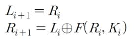

블록암호 DES (1)

우선 DES 는 대칭형 암호화 방식을 사용하고 있습니다. 
대칭형 암호화 방식은 암호문을 작성할 때 사용하는 암호키와 암호문을 해독할 때 사용하는 해독키가 같은 것입니다.

따라서 이 키가 외부에 유출되지 않도록 유의해야 하며 이 키를 비밀키라고 부릅니다. 또는 양쪽이 동일한 키를 사용한다고 하여 대칭키(Symmetric Key)라고도 부릅니다. 이러한 이유로 대칭형 암호화 알고리즘은 비공개키 알고리즘이라고도 부릅니다. 

비공개키 방식의 (Data Encryption Standard) 알고리즘은 블록 암호화 방식 중 하나 인데, 암호키와 암호화 알고리즘은 데이터 블록 단위로 적용되는 알고리즘 장식을 취합니다.암호화를 64비트 단위로 수행하며 암호키의 크기는 56비트입니다.

동일 평문에 대해서 암호화 했을 때, 각각 다른 내용의 암호문을 만들어 내기 위하여 이전 암호화 블록 암호문을 다음 블록에 순서대로 적용합니다. 즉, 평문의 첫 블록에 난수를 발생시키기 위한 초기화 벡터(S-BOX)를 조합해서 동일 평문이라도 다른 암호문을 출력하도로 만듭니다.

암호화 알고리즘을 만들때, 특정한 함수의 계산 반복으로 이루어집니다.
이때 반복되는 함수를 라운드 함수(Round function)라고 한다. 

우선 암호화 하려는 정보를 두개의 정보로 쪼개고 오른쪽(R), 왼쪽(L) 나누어서 (64비트 단위로 쪼갠 평문을 32비트씩 왼쪽 오른쪽으로 나눈다.) 각각의 라운드 함수에서 사용되는 키를 Ki 라우드 함수를 F라고 한다.

라운드 n 까지 반복이 이루어진 후, 최종적으로 (Rn+1, Ln+1)이 암호화 값이 생성된다. 다시 복호화를 하려면 왼쪽과 오른쪽에 들어갈 내용만 바꾸면 된다.

완벽하게 왼쪽 오른쪽만 바뀐다. 여기에서 유의해야 할 점은 Ki를 역순으로 넣어야 한다는 것이다.

이 복호화 연산이 라운드 n까지 반복된 뒤에는 원래의 값 (L0, R0)을 얻을 수 있다. 
이 알고리즘의 장점은 암호화 과정과 복호화 과정이 전부 같은 계산을 반복한다. 
 
DES 알고리즘의 간단한 도표이다.
1, 우선 평문블록을 64비트 단위로 자른다.
2, 64비트 키를 이용하는데 이중에서 56비트가 실제 사용되는 키가 되고, 8비트는 패리티비트로 사용된다. 

다시 돌아가서 도표를 설명해 보자면 64비트의 블록 단위로 자른 펴문을 난수를 발생시키기 위한 초기 순열에 넣고, 그후에 왼쪽 오른쪽 32비트로 쪼개고 오른쪽부분을 라운드 함수에 넣고 복잡하게 만든후 다시 배타적 논리합으로 왼쪽부분을 변환해주고 오른쪽 왼쪽을 바꾸어 다시 라운드 함수를 적용한다. 마지막에 초기 순열의 역순열을 전치하여 암호문을 만든다.
